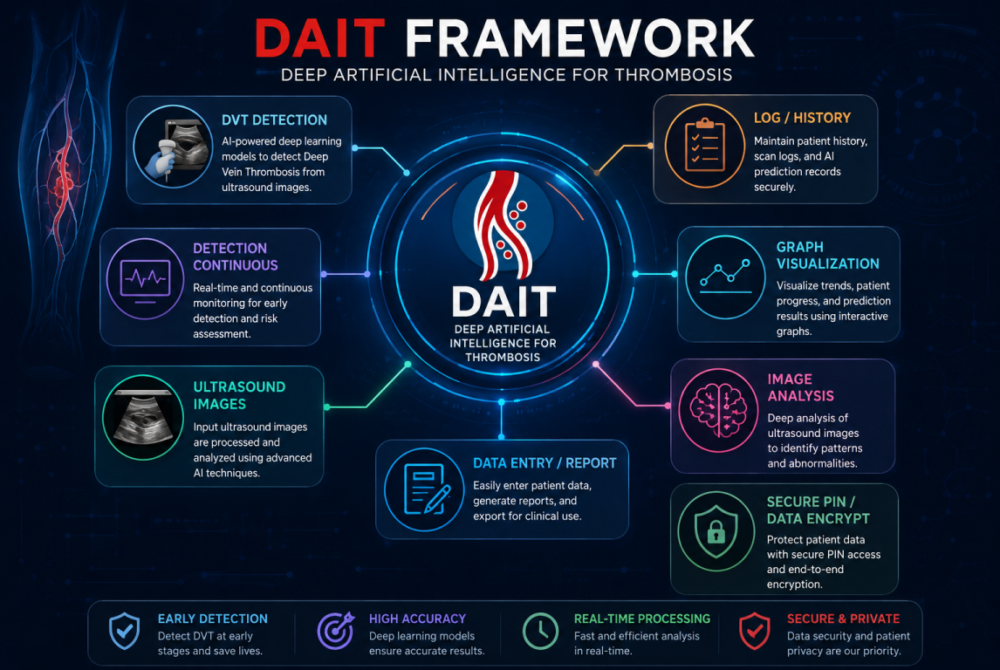

# DAIT-DEEP-ARTIFICAL-INTELLIGENCE-FOR-THROMBOSIS-FRAMEWORK
DAIT (Deep Artificial Intelligence for Thrombosis) is an advanced diagnostic framework designed to automate the early detection of Deep Vein Thrombosis (DVT) using deep learning architectures.

By analyzing vascular ultrasound imaging—specifically focusing on vein compressibility, intraluminal echoes, and Color Doppler flow voids—the platform extracts complex spatial features to pinpoint acute and proximal thrombi with high precision.

This AI-driven approach minimizes operator dependency, accelerates diagnostic workflows in emergency and clinical settings, and provides crucial decision support to prevent life-threatening complications such as pulmonary embolism.
# DAIT FRAMEWORK ARCHITECTURE

#  LINKS
 
LinkedIn:
https://www.linkedin.com/in/mr-abdullah-mohsin-5086a730b/

 
What`s app Group:
https://chat.whatsapp.com/Celq5mYMcsXINxIoZ9DQ8X

 
Community:
https://chat.whatsapp.com/Celq5mYMcsXINxIoZ9DQ8X

 
Github:
https://github.com/DVT-PROJECT

 

Facebook:
https://www.facebook.com/profile.php?id=100071199203900

#  DATASET INFORMATION:
check out kaggle to get information about the dataset of thrombus/non-thrombus of lower-limb
 
link:https://www.kaggle.com/datasets/abdullahmohsinune/thrombus-vs-non-thrombus-dataset-images/data
 
# Evidence:
link:https://drive.google.com/drive/folders/1qmGQyNLVvTgQwCCfGrOn0jQTI1oecbYu?usp=sharing
